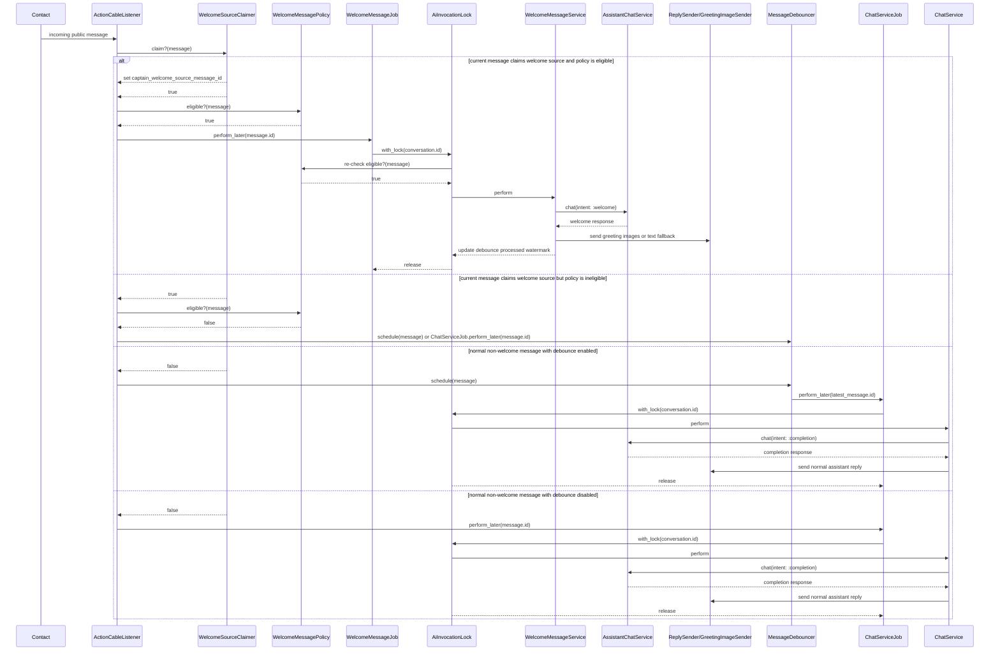

# Welcome Message Extraction Plan

## Goal

Move welcoming message orchestration out of `Captain::Copilot::ChatService` so first-touch welcome replies can bypass the debounce flow, while keeping normal chat replies debounced and preserving existing reply behavior.

## Current Problem

`Captain::Copilot::ChatService` currently handles multiple responsibilities:

- Normal chat reply orchestration.
- Welcome message detection.
- Welcome endpoint selection indirectly through Jangkau endpoint policy.
- Greeting image delivery fallback behavior.
- Reply persistence and conversation state updates.

Because welcome handling lives inside `ChatService`, it follows whichever route invoked `ChatService`: direct job or debounced job. This makes first-touch greeting latency dependent on debounce scheduling.

## Target Design

### `Captain::Copilot::ChatService`

- Handles normal assistant replies only.
- Does not know about welcome detection.
- Does not send greeting images.
- Calls LLM with explicit `intent: :completion`.

### `Captain::Copilot::WelcomeMessageService`

- Handles first-touch welcome orchestration.
- Runs the same eligibility checks as normal chat.
- Skips group conversations entirely.
- Calls LLM with explicit `intent: :welcome`.
- Sends greeting images with the generated response as caption.
- Falls back to text reply when no greeting images are configured.
- Increments AI usage after successful LLM response.

### `Captain::Copilot::WelcomeMessageJob`

- Runs welcome processing directly, without debounce.
- Loads the message and re-checks welcome eligibility after acquiring a conversation-level lock.
- Invokes `WelcomeMessageService` only if the message is still welcome-eligible.

### `Captain::Copilot::Policies::WelcomeMessagePolicy`

- Lightweight routing policy used before debounce.
- Determines whether an incoming message should be routed to the welcome path.
- Checks greeting config and whether the conversation has already received an AI reply.
- Treats group conversations as not welcome-eligible by default.
- Requires the conversation welcome source marker to match the current message.

### `Captain::Copilot::WelcomeSourceClaimer`

- Optimizes welcome routing by claiming the single message that closes the welcome opportunity for an AI-routable conversation.
- Uses a dedicated conversation marker instead of repeatedly querying messages on every follow-up.
- Performs a lazy fallback lookup when the marker is missing, so existing conversations do not need an upfront full backfill.
- Returns true only when the current message is the claimed welcome source message.
- Returns false for human-agent conversations that are not AI-routable, avoiding unnecessary writes.

### LLM Intent

LLM services should use explicit intent instead of inferring welcome state from conversation state.

- `intent: :welcome` uses `/v2/chat/welcome/`.
- `intent: :completion` uses `/v2/chat/completion/`.

This avoids duplicate welcome detection across `ChatService` and `JangkauEndpointPolicy`.

## Sequence Diagram



## Race Condition Note

Moving welcome logic out of `ChatService` does not automatically solve race conditions.

The root race exists because multiple asynchronous paths can process the same conversation while no AI reply has been persisted yet. This must be handled with a shared conversation-level AI invocation lock across welcome and normal chat jobs.

## Lazy Claim Optimization

Welcome is only possible once per conversation, but not every conversation is between a customer and an AI agent. Most human-agent conversations should not pay the write cost for AI welcome tracking.

Use a lazy claim model for AI-routable conversations only.

### Data Model

Add a dedicated nullable column on `conversations`:

```ruby
captain_welcome_source_message_id :bigint
```

Column meaning:

- `NULL`: welcome source has not been claimed or discovered yet.
- Matching current message ID: current message is the welcome source and may continue through welcome policy.
- Different message ID: welcome opportunity is already closed; route current message through normal chat flow.

This should be a dedicated column instead of `additional_attributes` for scalability:

- Cheaper reads and writes than JSONB updates.
- Safer concurrent updates.
- Easier debugging and operational queries.
- Avoids rewriting unrelated conversation attributes.

### Lazy Claim Flow

When an incoming public contact message reaches Copilot routing:

1. Return to normal routing if the message is not AI-routable.
2. If `captain_welcome_source_message_id` is already set, return true only when it equals the current message ID.
3. If the marker is `NULL`, query the first incoming public contact message in the conversation.
4. Atomically claim the marker with that first message ID using a conditional update.
5. Return true only if the claimed source ID equals the current message ID.

This keeps the final product rule intact:

```text
Welcome = first incoming public contact message in the conversation.
```

It also avoids a full upfront backfill. Existing conversations are handled lazily: the first post-deploy incoming message discovers the real first customer message, stores it, and follow-up messages skip the fallback query forever.

### AI-Routable Prefilter

Run the claimer only for conversations/inboxes that can actually use AI.

The prefilter should be cheaper than full welcome policy and should avoid writes for normal human-agent conversations. A minimal candidate is checking for an attached `AgentBotInbox`/AI agent for the message inbox.

### Atomic Claim

The claim must be race-safe:

```ruby
Conversation
  .where(id: conversation.id, captain_welcome_source_message_id: nil)
  .update_all(captain_welcome_source_message_id: source_message.id)
```

After the conditional update, read the marker again and compare it with the current message ID. This handles concurrent first/follow-up message processing without duplicate welcome routing.

The claim marker does not replace `AiInvocationLock`. The marker decides which message is the welcome source; the lock prevents simultaneous AI invocations for the same conversation.

## Implementation Steps

### 1. Add Welcome Message Policy

Create `app/services/captain/copilot/policies/welcome_message_policy.rb`.

Responsibilities:

- Build `Captain::Copilot::State::MessageContext`.
- Return false for group conversations.
- Check `ai_agent.display_flow_data.dig('greeting_config', 'enabled') == true`.
- Check that `conversation.captain_welcome_source_message_id == message.id`.
- Check `!Captain::Copilot::State::ConversationAiState.new(conversation).ai_replied?`.

Public API:

```ruby
Captain::Copilot::Policies::WelcomeMessagePolicy.new(message).eligible?
```

This policy is only for routing. Full subscription, availability, and meaningful-payload checks still run in the service.

Important: do not use `ConversationAiState#first_unprocessed_incoming_message` to define welcome eligibility. That method describes the current debounce processing window. A later user message can become the first unprocessed message after prior replies, but it should not become a welcome message.

After lazy claim is implemented, `WelcomeMessagePolicy` should not perform the first-message query directly. It should require `conversation.captain_welcome_source_message_id == message.id` and keep the rest of the eligibility checks.

### 1a. Add Welcome Source Claimer

Create `app/services/captain/copilot/welcome_source_claimer.rb`.

Responsibilities:

- Return false for non-incoming, non-public, non-contact messages.
- Return false for messages that are not AI-routable.
- Return whether the current message matches `captain_welcome_source_message_id` when the marker is already set.
- Lazily find the first incoming public contact message when the marker is missing.
- Atomically claim the conversation marker with the discovered source message ID.
- Return true only when the final marker equals the current message ID.

Public API:

```ruby
Captain::Copilot::WelcomeSourceClaimer.new(message).claim?
```

### 2. Add Explicit LLM Intent

Update `Captain::Llm::AssistantChatService`, `Captain::Llm::BaseJangkauService`, and `Captain::Llm::Policies::JangkauEndpointPolicy` to accept an explicit intent.

Expected behavior:

- Default intent is `:completion`.
- Welcome service passes `intent: :welcome`.
- Normal `ChatService` passes or defaults to `intent: :completion`.
- `Captain::Llm::Policies::JangkauEndpointPolicy` chooses endpoint based on intent instead of `first_message? && welcome_enabled?`.

### 3. Extract Shared Reply Sending

Extract reply persistence and conversation state handling from `ChatService` into a reusable collaborator, for example:

`app/services/captain/copilot/reply_sender.rb`

The collaborator should preserve current behavior:

- Process handover responses.
- Process end state responses.
- Process conversion responses.
- Dispatch reply through `Captain::Copilot::ReplyDispatcher`.
- Log success and failure.
- Support failure replies.

This prevents `WelcomeMessageService` from duplicating `ChatService#send_reply` behavior.

### 4. Add Welcome Message Service

Create `app/services/captain/copilot/welcome_message_service.rb`.

Flow:

1. Switch locale using account locale.
2. Run `EligibilityGuard`.
3. Log ineligible requests with `EligibilityGuardLogger`.
4. Send failure reply only for `:pre_check_failure`, matching current `ChatService` behavior.
5. Return without sending welcome if the conversation is a group conversation.
6. Call `AssistantChatService` with `intent: :welcome`.
7. Parse response with `ResponseFormatChatHelper`.
8. Increment AI response usage.
9. Send greeting images with response text as the first image caption.
10. Fall back to text reply if no greeting images are sent.

### 5. Add Conversation-Level AI Invocation Lock

Add a shared lock used by both welcome and normal chat jobs.

Possible implementation:

`app/services/captain/copilot/locks/ai_invocation_lock.rb`

Requirements:

- Lock scope is conversation-level.
- Used by `WelcomeMessageJob` and `ChatServiceJob`.
- Prevents simultaneous AI invocation for the same conversation.
- Ensures welcome re-check happens inside the lock.

This can use PostgreSQL advisory locks to match existing job style, or Redis locks if a TTL is required.

### 6. Add Welcome Message Job

Create `app/jobs/captain/copilot/welcome_message_job.rb`.

Flow:

1. Load message with attachments.
2. Acquire conversation-level AI invocation lock.
3. Re-check `WelcomeMessagePolicy`.
4. Return if no longer eligible.
5. Invoke `WelcomeMessageService`.

### 7. Update Listener Routing

Update `ActionCableListener#message_created` routing.

Target flow:

```ruby
if message.sender_type == 'Contact' && message.incoming? && !message.private?
  if Captain::Copilot::WelcomeSourceClaimer.new(message).claim? && Captain::Copilot::Policies::WelcomeMessagePolicy.new(message).eligible?
    Captain::Copilot::WelcomeMessageJob.perform_later(message.id)
  elsif Captain::Copilot::Config::DebounceConfig.for_message(message).enabled?
    Captain::Copilot::MessageDebouncer.new(message).schedule
  else
    Captain::Copilot::ChatServiceJob.perform_later(message.id)
  end
end
```

The broadcast behavior should remain unchanged.

### 8. Simplify Chat Service

After welcome service is active, remove welcome-specific code from `ChatService`:

- `welcome_message?`
- `send_greeting_images`
- `send_parsed_reply`
- `conversation_ai_state`, if unused
- `is_welcome` branching in `send_messages`

Normal flow should become:

```ruby
parsed = parsed_assistant_response
return unless parsed

reply_sender.send_reply(parsed, additional_attributes: reply_attributes(parsed))
```

### 9. Preserve Debouncer Behavior

`ProcessDebouncedConversationJob` should remain the normal path for non-welcome messages.

Expected behavior after routing change:

- First welcome candidate bypasses debounce.
- Follow-up messages still use debounce when enabled.
- Conversation-level AI lock prevents welcome and normal replies from running at the same time.
- Existing duplicate-reply guard in `ChatServiceJob` remains useful but should not be the only protection.

## Test Plan

### `WelcomeMessagePolicy`

- Eligible when greeting is enabled and no AI reply exists.
- Eligible only when `captain_welcome_source_message_id` equals the current message ID.
- Not eligible when `captain_welcome_source_message_id` is missing or points to a different message.
- Not eligible when greeting is disabled.
- Not eligible when an AI reply already exists.
- Not eligible for group conversations.
- Not eligible for later incoming messages, even when they are first in the current debounce/unprocessed window.
- Handles missing agent/config as not eligible.

### `WelcomeSourceClaimer`

- Claims the current message when it is the first incoming public contact message in a new AI-routable conversation.
- Returns true when the marker already points to the current message.
- Returns false when the marker already points to another message.
- For existing conversations with marker `NULL`, claims the earlier first incoming public contact message and returns false for the current follow-up.
- Does not claim private, outgoing, or non-contact messages.
- Does not claim non-AI-routable human-agent conversations.
- Uses a conditional update so concurrent claims settle on a single source message.

### `ActionCableListener`

- Welcome-eligible incoming message enqueues `WelcomeMessageJob`.
- Welcome-eligible incoming message does not schedule `MessageDebouncer`.
- Non-welcome incoming message keeps existing debounce routing.
- Non-welcome incoming message keeps existing direct routing when debounce is disabled.

### `WelcomeMessageJob`

- Re-checks policy inside the lock.
- Does not invoke service when policy is false after lock acquisition.
- Invokes `WelcomeMessageService` when policy is true.

### `WelcomeMessageService`

- Calls `AssistantChatService` with `intent: :welcome`.
- Sends greeting images with the response as caption.
- Falls back to text reply when no images are configured.
- Increments usage after successful assistant response.
- Skips group conversations without generating a welcome response.
- Preserves pre-check failure reply behavior.

### LLM Services

- `intent: :welcome` selects welcome endpoint.
- `intent: :completion` selects completion endpoint.
- Default intent remains completion.
- Welcome endpoint fallback to completion remains unchanged.

### `ChatService`

- Normal chat uses completion intent.
- Welcome-specific branching is removed.
- Existing normal reply behavior remains unchanged.

## Suggested PR Breakdown

1. Add `WelcomeMessagePolicy` and specs.
2. Add `captain_welcome_source_message_id` and `WelcomeSourceClaimer` with specs.
3. Add explicit LLM intent and update endpoint policy/specs.
4. Extract reusable reply sending from `ChatService`.
5. Add `WelcomeMessageService` and `WelcomeMessageJob`.
6. Add conversation-level AI invocation lock.
7. Update listener routing to bypass debounce for welcome.
8. Remove welcome logic from `ChatService`.

## Implementation Risks / Watchouts

### Race Between Welcome and Debounced Chat

Moving welcome out of `ChatService` does not remove race conditions by itself.

If `WelcomeMessageJob` and `ProcessDebouncedConversationJob` can invoke AI for the same conversation at the same time, both may observe that no AI reply exists yet and generate duplicate replies.

Implementation must ensure both welcome and normal chat paths use the same conversation-level AI invocation lock.

### Re-Check Welcome Eligibility Inside The Lock

The listener-level `WelcomeMessagePolicy` check is only a routing optimization.

`WelcomeMessageJob` must re-check the policy after acquiring the conversation lock. Otherwise a delayed job can still send welcome after another AI reply has already been persisted.

### Endpoint Selection Must Not Depend On Conversation State

After extraction, welcome endpoint selection should be driven by explicit intent, not by `ai_replied?`.

If `JangkauEndpointPolicy` continues to infer welcome from conversation state, timing can make a welcome flow call the completion endpoint or a normal flow call the welcome endpoint.

### Keep Reply Behavior Identical

`ChatService#send_reply` currently handles more than message persistence:

- Handover response processing.
- End state processing.
- Conversion processing.
- Reply dispatching.
- Success/error logging.

When extracting welcome delivery, this behavior must either be reused through a shared collaborator or intentionally excluded with a documented reason.

### Preserve Failure Reply Semantics

Current `ChatService` only sends a failure reply for `EligibilityGuard` result code `:pre_check_failure`.

Other ineligible states are logged and skipped silently.

`WelcomeMessageService` should preserve this behavior unless product explicitly wants a different welcome failure behavior.

### Usage Count Must Stay Consistent

Current flow increments AI response usage after a successful assistant response and before reply dispatch.

Welcome extraction must keep this accounting consistent for both image-based and text fallback welcome replies.

### Greeting Image Config Source Difference

Current code checks welcome enabled via `display_flow_data`, but `GreetingImageSender` reads images from `flow_data`.

This difference may be intentional or accidental. Do not normalize it casually during extraction unless the data contract is verified.

### Welcome Should Not Be Sent To Group Conversations

Welcome messages are intended as first-touch customer greetings. Group conversations are typically internal coordination spaces, so sending customer-facing welcome copy there is not a good default product behavior.

Implementation should make group conversations ineligible for welcome entirely, even when the bot is mentioned. `GroupMentionPolicy` should remain relevant for normal assistant replies in group conversations, not for welcome routing.

### Attachment And Meaningful Payload Checks

`EligibilityGuard` uses `question_payload` and AI-supported attachments to decide whether the request is meaningful for AI.

Welcome service must pass equivalent payloads so first messages with supported attachments behave consistently.

### Direct Routing Should Not Starve Debounced Follow-Ups

If a user sends multiple messages immediately after the first welcome-triggering message, follow-up messages should still be processed normally after welcome completes.

Avoid marking debounce watermarks too early or skipping follow-up messages just because welcome was sent for the first message.

Current debounce state uses `ConversationAiState#processing_boundary_message_id`, which includes `last_ai_reply_id`. If a welcome reply is saved after a follow-up user message, that AI reply can have an ID greater than the follow-up message. A later debounced job may then treat the welcome reply ID as the boundary and incorrectly skip the follow-up message.

Implementation should not rely on `last_ai_reply_id` alone to decide which incoming messages were answered by a direct welcome. Consider tracking the welcome source message ID or using a debounce-specific processed watermark so messages created before the welcome reply but after the welcome source message are not lost.

### Duplicate Reply Guard Is Not Enough

`ChatServiceJob#ai_already_replied_after?` is useful but should not be treated as the only protection.

It checks persisted AI replies. It cannot protect the window where another job is already generating a reply but has not saved it yet.

It can also become too broad after welcome extraction. If a welcome reply is saved after a follow-up user message, `ai_already_replied_after?` may skip the follow-up `ChatServiceJob` even though the welcome response did not answer that follow-up message.

Duplicate detection should distinguish between an AI reply that answered the same invocation and an unrelated welcome reply created later in the same conversation.

### Message Ordering And Caption Behavior

For image-based welcome, the first greeting image currently receives the assistant response as caption and no separate text reply is sent.

Extraction must preserve this ordering and avoid sending both image-caption and duplicate text unless intentionally changed.

Current image-based welcome also bypasses `ChatService#send_reply`, so it does not run handover, end-state, or conversion processing for that response. If shared reply sending is extracted, do not accidentally apply normal reply state transitions to image-based welcome unless this is an intentional product change.

`GreetingImageSender#perform` returns `true` when image refs are configured, even if individual image sends fail and are rescued. Current behavior is that configured-but-failed images can prevent text fallback. Preserve this behavior or explicitly decide to change it with tests.

### Welcome Source Message Tracking

Welcome routing should make it clear which incoming message triggered the welcome.

This is useful for:

- Re-checking whether the welcome is still valid.
- Avoiding duplicate welcome jobs.
- Preventing debounce from treating unrelated follow-up messages as already answered.
- Debugging direct welcome routing in logs.

Consider storing or logging the source message ID when `WelcomeMessageJob` starts and when the welcome reply is created.

The welcome source message should be the first incoming public contact message in the conversation. Follow-up messages should not be welcome-routed even if no AI reply has been persisted yet.

Use lazy claim through `captain_welcome_source_message_id` instead of backfilling every existing conversation upfront. Existing conversations with a missing marker must perform one fallback lookup, claim the real first incoming public contact message, and then route the current follow-up normally if it is not that source message.

### API Preview / Controller Callers

`Api::V1::Accounts::AiAgentsController` calls `AssistantChatService` directly for preview/chat-style interactions.

When adding explicit LLM intent, keep these callers defaulting to `:completion` so preview/manual chat endpoints do not accidentally call the welcome endpoint.

### Custom Agent Behavior

`AssistantChatService` routes custom agents to Flowise.

Before adding intent to `AssistantChatService`, verify that custom-agent paths either ignore intent safely or have an explicit behavior for welcome.

### Legacy `ChatDelayJob`

`app/jobs/captain/copilot/chat_delay_job.rb` appears to be legacy and currently references outdated `ChatService` APIs.

Do not base the welcome extraction on this job without first deciding whether to remove, repair, or ignore it.

### Job Argument Compatibility

Adding new job args or service kwargs should keep existing queued jobs in mind.

Prefer optional keyword args with defaults for jobs/services that may already have enqueued payloads.

### Observability

Add clear logs for:

- Welcome routed directly.
- Welcome skipped because no longer eligible.
- Welcome service started/completed.
- Welcome image sent vs text fallback.
- Lock acquisition/skip behavior if applicable.

This will make rollout issues easier to diagnose.

## Implementation Notes

- Keep the first PRs behavior-preserving where possible.
- Do not remove existing welcome behavior from `ChatService` until `WelcomeMessageService` is wired and tested.
- Prefer explicit intent over duplicating welcome detection in LLM endpoint policy.
