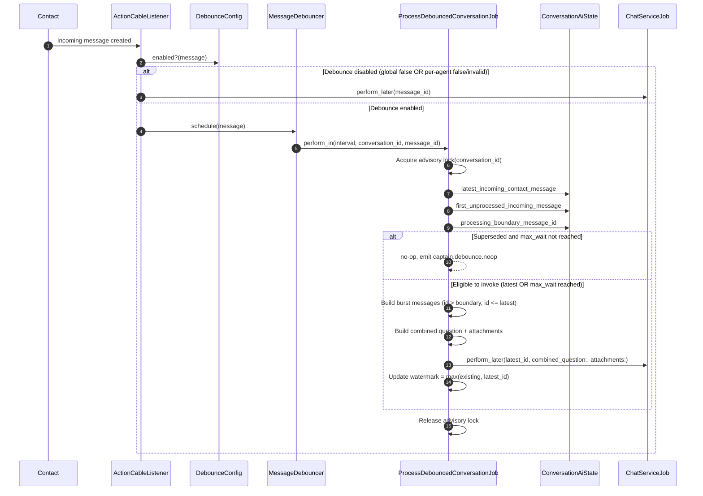

# Spec: Conversation-Level Trailing-Edge Debounce for AI Agent Invocation

**Status:** In implementation. Core debounce flow has shipped; this spec now includes replay-safe watermarking and per-`AiAgent` config precedence.
**Owner:** TBD
**Last updated:** 2026-07-03
**Scope:** `Captain::Copilot::ChatService` → `Captain::Llm::AssistantChatService` → `Captain::Llm::BaseJangkauService` (Jangkau branch only — Flowise explicitly out of scope, §9)

## 0. Design Change: No Redis, No Fencing Token

Earlier drafts of this spec used Redis (fencing token, TTL'd keys) to track debounce state. That's discarded here. Postgres already holds every incoming message with an accurate `created_at`, and Sidekiq/ActiveJob's own delayed-execution primitive (`perform_in`/`perform_at`) is sufficient to implement trailing-edge debounce without a second, parallel source of truth. Reasoning:

- A fencing token exists purely to answer "has a newer message arrived since I was scheduled?" — that's a question Postgres can already answer directly (`conversation.messages.incoming.where('created_at > ?', my_scheduled_at)`), with no separate state store needed.
- Removing Redis removes an entire class of bugs that only exist because of it: TTL misconfiguration silently dropping buffer state, and races between "check token" and "clear token" needing an atomic Lua/`GETDEL` operation.
- Cost: every debounce job does one extra read query when it fires, instead of a Redis round-trip. Negligible at chat-support message volumes.

If a future load profile genuinely requires avoiding that read (very high message volume, DB read pressure), Redis can be reintroduced — but that's a scaling problem to solve if and when it appears, not a default to build in from day one.

## 1. Problem Statement

Today, `ActionCableListener#message_created` calls `Captain::Copilot::ChatServiceJob.perform_later(message.id)` once per inbound customer message (confirmed integration point, §8). A burst of N rapid messages produces N separate calls to the external Jangkau agent API, each built from only that single message's text (confirmed in `base_jangkau_service.rb#extract_message_data` — the external API is stateful per `session_id`, and Chatwoot sends one incremental "question" per call; it does not receive full conversation history from Chatwoot itself). Goal: collapse a burst into exactly one invocation with one combined question.

## 2. Mechanism

**Trailing-edge debounce with a hard `max_wait` ceiling, using DB re-checks instead of Redis state:**

1. Inbound message arrives. In place of the current direct `ChatServiceJob.perform_later(message.id)` call, schedule:
   ```ruby
   Captain::Copilot::ProcessDebouncedConversationJob.perform_in(
     debounce_interval.seconds, conversation.id, message.id
   )
   ```
   Every message schedules its own job. No job is cancelled, no shared state is written up front — this is intentional; see §2.1 for why "do nothing on schedule" is safe.

2. When a scheduled job fires (`conversation_id`, `message_id` it was scheduled with), it asks exactly one question: **"Is this still the most recent customer message in this conversation, or has a newer one arrived since I was scheduled?"**
   ```ruby
   latest = conversation.messages.incoming.where(sender_type: 'Contact').order(:created_at).last
   return if latest.id != message_id  # a newer message exists; that message's own job will handle this burst
   ```
   If a newer message arrived, this job is a no-op — the newer message's own scheduled job will perform the same check later and (assuming no even-newer message has arrived by then) will be the one that proceeds. This is the entire debounce mechanism: **only the job scheduled by the chronologically last message in a burst ever proceeds.**

3. **`max_wait` enforcement**, checked in the same job before it decides to proceed:
   ```ruby
   first_in_burst = first_unprocessed_incoming_message(conversation) # see §2.2
   if Time.current - first_in_burst.created_at >= max_wait
     # ceiling reached — proceed now regardless of how recent `latest` is
   elsif latest.id != message_id
     return # not the latest message yet, and still within max_wait — let the newer message's job handle it
   end
   ```

4. Once a job determines it should proceed: gather every incoming customer message since the processing boundary (see §2.2) up to and including `latest`, build the combined question (§3), and call `Captain::Copilot::ChatServiceJob.perform_later(message_id, ...)` exactly once for that window.

### 2.1 Why scheduling redundant jobs per-message is safe and not wasteful

Every message in a burst schedules a job, but only the last one's job ever does real work — every earlier job's check (`latest.id != message_id`) fails fast with a single indexed query and returns immediately. This trades "N scheduled jobs per burst, N-1 of which are cheap no-ops" for "zero shared mutable state, zero race conditions, zero TTL to misconfigure." At chat-support volumes this trade is clearly worth it; flag for revisit only if profiling ever shows job-scheduling overhead as a real cost.

### 2.2 Defining the processing boundary (replay-safe)

Using only `last_ai_reply_at` is not sufficient when AI replies are delayed: a second burst can re-include messages that were already sent to AI by a previous debounce invocation.

Required boundary rule:

- `processing_boundary_message_id = max(last_ai_reply_id, last_debounced_processed_message_id)`.
- `last_debounced_processed_message_id` is stored in `Conversation.additional_attributes`.
- Burst message selection is by `id` window (`id > processing_boundary_message_id` and `id <= latest.id`) for deterministic replay-safe behavior.

### 2.3 Concurrency and watermark update

Debounce job execution for a conversation must be serialized:

- Use a PostgreSQL advisory lock keyed by `conversation_id`.
- Inside the lock: evaluate superseded/max-wait checks, build burst payload, enqueue one `ChatServiceJob`, then update watermark.
- Watermark update must be monotonic: `last_debounced_processed_message_id = max(existing, latest.id)`.

This guarantees overlapping scheduled jobs do not enqueue duplicate overlapping windows.

### 2.4 Sequence diagram



## 3. Combined Question Construction

Given the ordered set of messages in the burst (from §2.2's definition through `latest`):

- **Single message in the burst (the common case):** pass it straight through, unchanged from today's behavior.
- **Multiple messages:** concatenate `.content` values (newline-joined, chronological order) into a single string, passed in place of the `Message` object at the `AssistantChatService`/`BaseJangkauService` boundary — this works because `extract_message_data` already special-cases a `String` input.
- **Accepted regression, tracked as a separate follow-up spec — not a pending sign-off.** Passing a `String` instead of a `Message` skips `enrich_question_with_reply_context` (WhatsApp reply-quote enrichment). **Decision:** this spec ships as-is; handling reply-quote enrichment for multi-message bursts is deferred to a separate follow-up spec (not yet written). Until that follow-up ships, WhatsApp customers who use the reply/quote feature and then send a burst of >1 message will lose that quoted context in what the AI Agent sees — this is a known, live regression starting the moment this spec is deployed, not a theoretical future gap. Track the follow-up spec explicitly (ticket/issue reference: **TBD** — add before implementation begins) so this doesn't silently become permanent by default.
- **Required code change:** `ChatService#send_messages` must start passing `attachments:` through to `AssistantChatService.new(...)`, gathered from every message in the burst, not just the last. This kwarg isn't forwarded today at all.
- **Confirmed low-cost:** attachments are blob references (`key`, `file_type`, `filename`, `url`), fetched by the external agent itself — concatenating them across a burst has negligible payload cost.

## 4. The "First Message" Check Exists in Two Places — Both Must Be Fixed Together

Identical logic, duplicated in `chat_service.rb#welcome_message?` and `base_jangkau_service.rb#first_message?`:
```ruby
conversation.messages.incoming.where(private: false).count == 1
```
Once debounce delays invocation, a first-contact burst of 3 messages makes both evaluate `count == 3`, breaking two things simultaneously: greeting images won't send, and the external Jangkau API will be routed to `/v2/chat/completion/` instead of `/v2/chat/welcome/`. **Recommendation:** extract one shared check (e.g. "no AI Agent reply exists yet for this conversation") and use it in both places. Fixing one without the other leaves a half-working, hard-to-debug inconsistency.

## 5. Configuration

Global, via `.env`:

| Variable | Suggested default |
|---|---|
| `CAPTAIN_DEBOUNCE_INTERVAL_SECONDS` | 10 |
| `CAPTAIN_DEBOUNCE_MAX_WAIT_SECONDS` | 60 |
| `CAPTAIN_DEBOUNCE_ENABLED` | `true` |

[Guessing] Interval/max-wait defaults are placeholders pending real usage data.

**`CAPTAIN_DEBOUNCE_ENABLED` is a new addition, not previously in scope, and it's not optional.** Every AI Agent reply in the account goes through this code path once shipped. Without a flag that reverts to today's direct `ChatServiceJob.perform_later(message.id)` call when `false`, the only way to recover from a bug here in production is a deploy. That's an unacceptable blast radius for a one-line config guard.

Per-`AiAgent` override (when global kill switch is `true`):

- Source: `ai_agents.display_flow_data.debounce_config`.
- This must stay out of `flow_data` so it is not forwarded as Jangkau runtime vars.
- Resolution precedence:
  - `CAPTAIN_DEBOUNCE_ENABLED=false` => debounce OFF for all agents.
  - Global true + per-agent `enabled=false` => debounce OFF (direct path).
  - Global true + per-agent `enabled=true` + valid values => debounce ON with per-agent values.
  - Global true + per-agent `enabled=true` + invalid values => debounce OFF for that agent (direct path, with warning log).
  - Missing per-agent config => debounce OFF for that agent (direct path).
- Validation:
  - `interval_seconds` integer `>= 5`
  - `max_wait_seconds` integer `>= 30`
  - `max_wait_seconds >= interval_seconds`
- New `AiAgent` default config:
  - `enabled=false`
  - `interval_seconds=15`
  - `max_wait_seconds=60`

## 6. Failure Handling

No retry, no automatic handover — skip, per product decision. `ChatService`'s existing internal failure path (`send_reply_failure`) is unaffected and still applies once the debounce logic calls it. Since there's no more "the job silently never fires" risk from Redis TTL expiry (§0 removes that failure mode entirely), the main residual risk is a Sidekiq queue outage delaying `perform_in` jobs generally — an infra-level concern outside this spec's scope, not specific to debounce.

## 7. Observability

Minimum metrics required at launch, not a follow-up:

- **Messages-combined-per-invocation** (distribution) — the entire point of this feature is fewer, larger invocations; without this metric there's no way to confirm it's working post-launch.
- **Time from first-message-in-burst to invocation** — validates debounce/max_wait behavior matches configured values in production.
- **No-op job rate** (jobs that exit early because a newer message superseded them) — expected to be high and is a sign the mechanism is working, not a problem; useful as a sanity check that the ratio roughly matches burst sizes.
- **AI invocation failure rate post-debounce** — a failure now affects the whole burst, not one message; blast radius is larger, worth tracking separately from pre-debounce failure rate.
- **Watermark diagnostics in logs** — include `processing_boundary_id`, `watermark_before`, `watermark_after` on invocation/update logs for replay debugging.

## 8. Integration Point — Confirmed

`app/listeners/action_cable_listener.rb#message_created`:
```ruby
Captain::Copilot::ChatServiceJob.perform_later(message.id) if message.sender_type == 'Contact'
```
becomes:
```ruby
if message.sender_type == 'Contact' && message.incoming? && !message.private?
  if Captain::Copilot::DebounceConfig.for_message(message).enabled?
    Captain::Copilot::MessageDebouncer.new(message).schedule
  else
    Captain::Copilot::ChatServiceJob.perform_later(message.id)
  end
end
```
`Captain::Copilot::ChatServiceJob` itself is unchanged. `MessageDebouncer#schedule` just does the `perform_in` call from §2 step 1 — it owns no state.

**Minor item to confirm during implementation:** whether `sender_type == 'Contact'` alone is sufficient to exclude activity messages/private notes — worth a quick check against the `Message` model.

## 9. `custom_agent` / Flowise Branch — Explicitly Out of Scope

`BaseFlowiseService` is no longer in active use per product decision; this spec covers the `BaseJangkauService` path only. Residual risk: `ChatService`/`AssistantChatService` still branch on `@ai_agent.custom_agent?` at the code level, so nothing prevents a future account being configured with a custom agent. Recommendation: log a warning if `custom_agent?` is true at the point this logic would fire, so the scenario is visible rather than silently mishandled. Not a blocker.

## 10. Architecture — Runtime Components

1. **Interception point** — `ActionCableListener#message_created` (§8). No debounce logic inside `ChatService` itself.
2. **`Captain::Copilot::Config::DebounceConfig`** — central precedence and validation resolver for global + per-agent debounce behavior.
3. **`Captain::Copilot::MessageDebouncer`** — stateless scheduler wrapper that reads interval from `DebounceConfig` and enqueues `ProcessDebouncedConversationJob`.
4. **`Captain::Copilot::State::ConversationAiState` + `ProcessDebouncedConversationJob`** — replay-safe boundary resolution, superseded/max-wait decision, burst payload build, single downstream enqueue, monotonic watermark update under advisory lock.

## 11. Resolved Decisions

1. `max_wait` approved (§2).
2. AI invocation failure: no retry, no handover — skip (§6).
3. Config: global via `.env`, now including a kill switch (§5).
4. Mid-buffer human handover: out of scope, feature doesn't exist in this fork.
5. Flowise/custom_agent: out of scope (§9).
6. Redis-based fencing token design: discarded in favor of DB re-check via scheduled-job self-comparison (§0, §2).
7. WhatsApp reply-quote enrichment for multi-message bursts: accepted as a known regression on ship, deferred to a separate follow-up spec (§3) rather than blocking this implementation.
8. Replay-safe boundary uses conversation watermark (`last_debounced_processed_message_id`) plus last AI reply id, with advisory lock and monotonic watermark writes (§2.2, §2.3).
9. Debounce behavior can be overridden per `AiAgent` via `display_flow_data.debounce_config`, but global kill switch always wins (§5).
